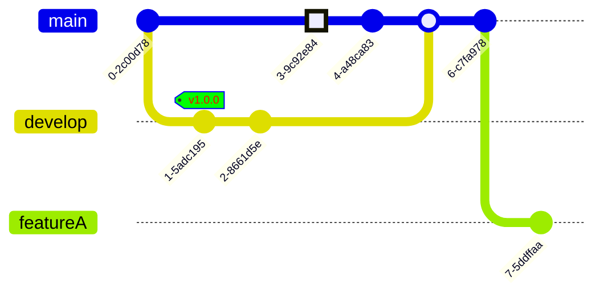

# Git



## Um pouco de história

[^Entendendo_GIT_AKITA]

Eis que na virada do século surge a BitMover e seu produto BitKeeper. Muita gente pensa  que a principal diferença era ser descentralizado. Mas na realidade a principal novidade foi tornar branches, forks e principalmente merges, operações razoavelmente triviais. Um trabalho que podia levar horas ou dias reduzido pra minutos, e com muito menos margem de erros. 

Por isso que apesar de ser um produto comercial de código fechado, por pragmatismo, o Linus resolveu migrar o desenvolvimento do kernel do linux pro BitKeeper. Isso foi em 2002, mas em 2 ou 3 anos a BitMover resolveu botar restrições demais ao ponto que o Linus se encheu. Com o CVS e Subversion, que eram as alternativas open source, muito atrasados em relação ao BitKeeper, as outras alternativas comerciais não atendiam, muitos começaram a pensar em novas soluções. 

Assim em 2003 surgiu o Darcs e em 2005 surgiu o Mercurial e a própria Canonical que mantém o Ubuntu fez o Bazaar. E também em 2005 o próprio Linus resolveu fazer o Git. 

No papel todos eles são muito parecidos. Sistemas de versionamento descentralizados com foco em resolver o problema de branches e merges. A diferença é que todos eles tinham problema de performance, menos o Git. Mercurial e Bazaar eram feitos em Python, então eles não tem como escalar em performance até certo ponto. Darcs também era criticado por problemas de performance. O Git, por outro lado, feito pelo Linus sempre foi hiper rápido, porém difícil de usar. Mas em casos como esse, performance e, principalmente segurança, tem prioridade.

## Git conceitos basicos

O Git é um sistema de controle de versão distribuído amplamente utilizado para rastrear alterações em projetos de software. Ele permite que várias pessoas trabalhem em um projeto simultaneamente, registre todas as alterações feitas e facilite a colaboração e o gerenciamento de código-fonte. Aqui estão alguns conceitos básicos do Git:

## Repositório

Um repositório Git é um diretório onde o código-fonte e os arquivos relacionados são armazenados. Ele contém todo o histórico de alterações feitas no projeto.

Para iniciar um repositório:

```shell
git init
```

##  Clone
O clone é o processo de criação de uma cópia local de um repositório remoto. Isso permite que você obtenha uma cópia completa do projeto em seu computador e trabalhe com ele.

## Commit

Um commit é uma operação fundamental no Git, que registra uma ou mais alterações no repositório. Cada commit tem uma mensagem associada que descreve as alterações feitas. Os commits permitem rastrear quem fez quais alterações e quando elas ocorreram.

# Merge (mesclar)

O merge é o processo de combinar as alterações de um branch a outro. Quando você deseja incorporar as alterações de um branch secundário de volta ao branch principal, você realiza um merge. O Git tenta combinar automaticamente as alterações, mas pode ocorrer conflitos se as mesmas partes do código forem modificadas em ambos os branches. Nesse caso, é necessário resolver manualmente os conflitos.

## Branch (ramo)

Um branch é uma linha de desenvolvimento separada dentro de um repositório. Ele permite que você crie e trabalhe em uma versão isolada do projeto sem afetar a linha principal de desenvolvimento (geralmente chamada de "branch master" ou "branch principal"). Os branches são úteis para adicionar novos recursos, corrigir bugs ou experimentar ideias sem comprometer o código estável.


## Pull Request

Uma Pull Request (PR) é uma solicitação para mesclar as alterações de um branch em outro branch. É uma prática comum em projetos colaborativos, onde um desenvolvedor solicita que outras pessoas revisem e aprovem suas alterações antes de mesclá-las ao branch principal. As PRs fornecem um local centralizado para revisão e discussão do código.

## Remote

O repositório remoto é uma cópia do seu repositório local, hospedada em um servidor. Ele permite que você compartilhe seu código com outras pessoas e colaboradores. O Git fornece comandos para clonar um repositório remoto para seu ambiente local e sincronizar suas alterações com o repositório remoto.


## Fork

Um fork é uma cópia independente de um repositório Git. É uma funcionalidade que permite a criação de um novo repositório a partir de outro existente. Ao fazer um fork, você cria uma cópia completa do repositório original, incluindo todo o histórico de commits.

O fork é frequentemente usado quando você deseja contribuir para um projeto de código aberto ou colaborar com outros desenvolvedores. Ao fazer um fork de um repositório, você cria sua própria cópia onde pode fazer alterações sem afetar o projeto original. Isso permite que você experimente, faça melhorias ou corrija bugs em seu próprio repositório fork.

Depois de fazer as alterações em seu repositório fork, você pode enviar uma Pull Request para o repositório original. Uma Pull Request é uma solicitação para que as alterações feitas no seu repositório sejam consideradas para incorporação ao projeto original. Os mantenedores do projeto original podem revisar suas alterações, discutir e decidir se desejam mesclá-las ao repositório principal.

Os forks são especialmente úteis em projetos de código aberto, onde várias pessoas podem contribuir simultaneamente sem precisar de acesso direto ao repositório principal. Isso ajuda a manter o controle sobre o código-fonte do projeto original, enquanto permite a contribuição de uma ampla comunidade de desenvolvedores.

## Links

[https://dev.to/leandronsp/pt-br-fundamentos-do-git-um-guia-completo-2djh](https://dev.to/leandronsp/pt-br-fundamentos-do-git-um-guia-completo-2djh)

<!-- 


O BitKeeper é um sistema de controle de versão distribuído (DVCS) que ganhou destaque por sua importância na história do desenvolvimento de software de código aberto, especialmente no contexto do kernel do Linux. Vamos falar mais sobre o BitKeeper e seu papel significativo:

**História do BitKeeper:**
O BitKeeper foi desenvolvido pela BitMover, Inc. e lançado em 2000 como um sistema de controle de versão comercial. Ele foi criado por Larry McVoy, um engenheiro de software com experiência em desenvolvimento de sistemas operacionais Unix.

**Características Notáveis:**
O BitKeeper apresentava várias características notáveis que o tornaram atraente para desenvolvedores de software, incluindo:

1. **Eficiência:** O BitKeeper era conhecido por ser rápido e eficiente no gerenciamento de grandes repositórios de código.

2. **Modelo de Desenvolvimento Distribuído:** O BitKeeper adotou um modelo de desenvolvimento distribuído antes mesmo do Git se tornar amplamente conhecido. Isso permitia que os desenvolvedores trabalhassem em ramos separados e mesclassem suas alterações de forma eficaz.

3. **Facilidade de Uso:** O BitKeeper foi projetado para ser fácil de usar, tornando-o uma escolha acessível para equipes de desenvolvimento.

**Uso no Kernel do Linux:**
O BitKeeper ganhou destaque quando o próprio Linus Torvalds, criador do Linux, adotou o BitKeeper para gerenciar o código-fonte do kernel do Linux em 2002. O uso do BitKeeper permitiu que o desenvolvimento do kernel do Linux se tornasse mais eficiente e colaborativo.

No entanto, a relação entre a comunidade de código aberto e a BitMover, a empresa por trás do BitKeeper, ficou tensa quando a BitMover decidiu encerrar o suporte gratuito para o BitKeeper em 2005. Isso levou à remoção do BitKeeper do kernel do Linux, e Linus Torvalds iniciou o desenvolvimento de sua própria ferramenta de controle de versão distribuída, que se tornou o Git.

**Transição para o Git:**
A transição do kernel do Linux para o Git foi um momento crucial na história do controle de versão distribuído. O Git foi criado por Linus Torvalds e foi influenciado pela experiência com o BitKeeper. O Git se tornou um sistema de controle de versão altamente eficaz e o padrão ouro para o desenvolvimento de software de código aberto e privado.

Em resumo, o BitKeeper desempenhou um papel significativo na história do controle de versão distribuído e influenciou diretamente o desenvolvimento do Git. Embora o BitKeeper tenha perdido destaque após o incidente com o kernel do Linux, sua contribuição para a evolução das ferramentas de controle de versão é inegável.


Modelo de fluxo de trabalho para versionamento de código que visa manter um processo organizado e padronizado entre as branches. 

Git - git flow na prática - YouTube
https://www.youtube.com/watch?v=wzxBR4pOTTs

<iframe width="560" height="315" src="https://www.youtube.com/embed/wzxBR4pOTTs" title="YouTube video player" frameborder="0" allow="accelerometer; autoplay; clipboard-write; encrypted-media; gyroscope; picture-in-picture; web-share" allowfullscreen></iframe>

Transcript:
(00:00) e fala pessoal beleza oi gente entramos na área de extras de versionamento e vamos hoje falar sobre o beach flor e flor basicamente é um fluxo de trabalho em que visa ditar regras de relacionamento entre brites entre merges que acontecem entre brancos padrões de nomenclatura ânimos ajuda bastante a manter um fluxo de trabalho organizado a
(00:30) bem padronizado e antes de nós falarmos sobre ele que é um fluxo bastante robusto acho que vale citar o bit heavy flow que é um fluxo bem simplificado que basicamente ele sugere que temos uma branch master é um toda vez que foram os trabalhar em alguma coisa eu queria uma sítio e terminei de desenvolver a fiat eu médico
(01:02) para master se eu tiver algum problema na minha master eu posso criar um bonde fixa e desenvolver a correção dela é basicamente é isso então eu só queria uma branch para proteger a minha master nessa de volta para ela e é isso é um é um fluxo bastante simplificado bom e que pessoalmente eu acho bastante
(01:26) válido para aplicações pequenas e como aplicação pequena eu quero dizer o desenvolvimento de uma linha de um peixe ou de um cms que vai envolver 12 desenvolvedores e não tem porque fazer um fluxo a complexo digamos assim então um fluxo simplificado como o bit of flow já resolverem o problema para aplicações um
(01:56) pouquinho maiores aí nós temos esse gente falou aí ele já não sugere um número de brancos bem maior e eu também tenho é uma extenção do bitflow que eu faço usar que ela me ajuda a fazer essas criações dessas brantz as os melhores o fluxo como um todo muitos muitas empresas muitos desenvolvedores acabam
(02:32) usando esse fluxo eu até tenho ele no ar numa visualização horizontal para te enxergar um pouquinho melhor muitas empresas acabam usando esse fluxo só a essência dele mas não utilizam o bitflow propriamente dito a extensão dele então só se inspiram nele então tá a gente vai desenvolver inspirado no hit flor e aí
(02:57) eu vou ter uma branch master eu vou ter a minha deve que vai ser vai ser original da master a partir dela eu vou eu vou gerar relizes da minha aplicação e e da deve eu vou desenvolver fixados eu vou me inspirar nesse conceito mas não vou seguir à risca então tem muitas empresas que fazem isso isso a resolve
(03:24) ou faço algo em parte em geral os seus problemas hoje eu vou mostrar para vocês como usar a extensão do bitflow e como ela nos ajuda a melhorar ainda mais esses padrões sabe o que vocês precisam ter em mente a o beautiful aquele sugere nessa master até que a gente vai rotulando então nasceu aqui nasceu aqui é a minha
(03:50) versão 1.0 depois quando for atualizado vai ser a 1.11.2 na próxima no próximo update perceber a master e assim por diante mas o fluxo é o seguinte eu tenho a master a minha mostra protegida ninguém mexe nela e eu de cara eu já passo para minha de vela e nela que eu vou desenvolver o meu fluxo e na verdade eu não vou meter
(04:19) muito a mão dentro dela a ideia é a cada fischer que algum deve for pegar para desenvolver ele não vai desenvolver direto na deve ele vai criar uma nova mente vai chamar de fitch ou alguma coisa oi e aí vai desenvolver a funcionalidade quando terminar ele vai enviar para deve então a deve vai receber todas as nossas
(04:47) as fitness e os desenvolvedores foram criando e conforme o acumulado de fitilhos recebidas na na nossa mente deve a for considerada que ali foi gerado o entregável aí então isso vai ser entregue para nossa ambiente de release na brene a aqui é o que a gente chama de do nosso ambiente de homologação então a nossa release ela
(05:19) representa o nosso ambiente de homologação ali é o ambiente que nós vamos entregar porque a testar ou para o cliente validar o e conforme a validação isso pode gerar alguns fix então esses comics que aparecem aqui eles não são filhos que estão sendo desenvolvidas aqui dentro eles representam um hotfix a fixo que eu
(05:47) tive que realizar dentro da frente the release ou documentação coisas desse tipo mas não funcionalidades a validade da nossa branch the release eu então entrego em supra master que a máscara vai representar o meio ambiente de produção então tem um ambiente de produção na master ambiente de homologação na release
(06:16) o ambiente de desenvolvimento na deve então a partir dela eu creio várias fichas a sítios conforme concluídas pelos desenvolvedores elas logo vão sendo mescladas na nossa deve tá então esse é o fluxo básico do beautiful tem uma documentação da classe a que é bem boa a referente a gente falou eu vou deixar na descrição aqui para vocês
(06:48) darem lá uma conferida mas o que vocês precisam bom e quem tá usando o mac e vai precisar instalar o edilon até não sei se já não tá vindo no mac tá a conforme vocês instalar um kit talvez sim se não vocês vão instalar através do brio aí e babadinho não tem muito ruim para quem tá usando o windows quando
(07:10) vocês instalam o vixe ele já já tá vendo convite flor então é só vocês utilizarem o utilitário eu vou mostrar para vocês como a gente cria esses fluxos eu vou manter aqui essa imagem porque ela vai nos ajudar a enxergar algumas coisas bom primeiramente eu deixei criado um um diretório chamado multiflon
(07:37) é nesse diretório bitflow ele não é um diretório pressionado ainda ele não tá sendo rastreado ou não não foi inicializada o repositório aqui ó a primeira coisa que eu faria ao natural seria dá um kitnet para inicializar o repositório e iria criar uma master aqui eu já vou usar o bitflow iniciar bitflow
(08:03) e nete eu já tô sinalizando para o beach que eu porque eu tô criando e eu vou eu vou trabalhar convite flor nas repositório e aí me pergunta assim ó qual é o nome da tua branch de produção e ele me sugere assim tudo é só entra eu vou aceitar como master e essa mesmo e qual é a tua o nome da brand the
(08:28) release e ele sugere develop eu vou aceitar e aí a essas duas brantz elas são as que vão se manter ao longo do projeto tá essas que vem como antes disso porte são as brites que vão ser automaticamente excluídas do meu repositório então quando eu conforme o acabar o trabalho com elas que eu mandar que eu disse aqui
(08:58) finalizou elas já vão automaticamente excluídas isso aqui já é um uma ação que o kit flor vai fazer é bastante comum nós vemos os repositórios poluídos com um monte de brent perdida que não precisava existir que já já foram encerrados o vídeo falou aqui já vai se encarregar de dar sumiço nelas oi e aí eles assim ó eu vou criar alguns
(09:26) prefixos para suas lentes tá qual é o prefixo que tu quer para tua branch the features ele já me sugere sítio barra tá isso é é padrão eu vou sentar vou and release vai ser release barra eu aceito hotfix também aceito suporte aceito a versão time prefixo eu quero adicionar algum prefixo de tag tipo ver eu não vou
(09:56) adicionar nada tá e aqui eu criei já observa em só que legal quando eu criei a quando finalizou eu já caí dentro da brand development o sindec english british vocês vão ver que eu tenho a deve e já tem a master eu tenho essas duas então essa e essa são as nossas duas fixas as outras elas são criadas e excluídas conforme utilizadas
(10:28) e conforme não utilizadas mais cara então ele criou a master e já criou a deve certo aqui não nos é relevante o tipo de projeto que vai tá rodando aqui tá nós digamos que na minha deve eu vou eu vou trabalhar numa funcionalidade agora ela acha que em outros exemplos eu usei uma calculadora então usar mesmo o
(11:00) mesmo conceito aqui porque é simples ah tá eu vou trabalhar não a funcionalidade de soma e eu não vou desenvolver isso dentro da deve observem aqui ó eu vou criar uma branch fitio e eu vou trabalhar dentro dela e aí eu vou dizer assim ó convite aí eu vou usar o gift flow free features it flow future never dies assim ó street
(11:27) inicia e agora vou dizer qual é o nome da amante e eu não preciso adicionar o prefixo o fiat uno barra e já é automático eu só vou dar um nome você lá ver se a senhora você quer abrangente que vai criar a funcionalidade de soma ah tá fica aparecendo o log aqui do que é que foi feito ó ó foi criado um
(11:51) ambiente feature some então o padrão fica por conta dele então não vou ter aquele problema de lá o cara esqueceu de botar o prefixo fiat uno ambiente ficou bagunçado mas agora já deixa assim mesmo não é só que ele vai colocar sempre então ele criou hoje a senhora tu já tá na band o fit adoção e agora faz o que tu tem que fazer e
(12:15) depois ó ele já me diz o que que eu tenho que fazer na sequência bitflow surf x1 é isso eu vou ter que fazer na sequência nós vamos lá fazer assim ó vou criar um som só um arquivo aqui que vai representar som matar e eu vou adicionar e vó como está ó e vou dizer assim adiciona funcionalidade de soma
(12:49) ah beleza eu vou desenhar acabei o trabalho aqui tá isso aqui tá obviamente só ilustrando a funcionalidade então eles a seguinte flow fischer a gente vai fazer assim ó o guichê brunch para vocês olharam eu tenho a 10 eu tenho a sítio sambaqui onde eu tô e eu tenho amostra e agora sim eu vou descer leite flor
(13:19) fischer i finish autorização o que que eu vou fechar vou fechar uma sítio qual feature as an an e por meios convencionais o que que eu faria aqui é o navegaria para mim abrantes deve lá na minha mãe deve eu diria que ela tá aí executaria na verdade um kit mary com a fiat opção para mesclar eu poderia acontecer de eu ir direto na
(13:50) master e mesclar com a master ou eu de alguma fórmula é o burle errar fim e quebrar o fluxo do netflix aqui não eu digo assim ambiente flor fischer finish some quando eu faço isso daqui ele já foi lá e fez omerj na deve então ele já respeitou o fluxo como isso era uma ficha e o fluxo diz assim ó a features
(14:23) ela só entrega para deve então foi isso que ela já fez ó ela mesclou com a deve oi e aí some feature branch futuros ano recebem removido então já exclui a somente porque ela terminou o trabalho dela e ele já me colocou de volta lá deve então ele simplificou todo o os passos que eu teria que fazer para fazer
(14:49) a mescla da minha a funcionalidade que eu teria desenvolvido aqui tô lá na defe certo posso ainda eu poderia ter tranquilamente o estado calma sei lá uma subir aqui ah tá vou criar um arquivo que vai representar a subir vou adicionar o vou comentar e aí me adiciona a funcionalidade de subtração tá certo
(15:36) eu repito do mesmo jeito de flor quero fechar uma fita eu vou dizer que eu vou fechar ela e quem é é a sup ó fechei mesmo esquema tô aqui se eu olhar o que que eu tenho eu tenho a subir tem as an tô com as duas da minha deve então basicamente desenvolvi duas fitness e mesclei com a minha deve agora observa em um momento em que eu quero
(16:04) agora criar a minha a minha release e aí cara é a mesma coisa posso até fazer aqui ó se eu voltar aqui ó eu tinha usado aqui é um bitflow fischer start subir se vocês olharem mostrar até aqui na na documentação a quando ele está tratando bom dia bom de trabalhar com a release a sugestão aqui o que a gente use uma um uma release a
(16:44) semântica uma tag né então é isso que a gente vai fazer ali ó vou fazer it flow o difícil vai ser uma release o start e o nome da minha release nome da minha release como nós exemplo lá vou considerar que isso aqui é o concluiu uma entrega eu vou colocar 0.1.0 eu vou mandar ver ele vai dizer assim ó
(17:21) beleza tu tá agora na branch release em e agora é isso aqui representaria o nosso ambiente de homologação a provavelmente eu ousaria alguns iai aqui então conforme eu enviei dado para release isso já vai subir automaticamente a no meio ambiente de uma oração com iniciar e um seguir configurado e nesse momento o meu quer a
(17:55) pode testar o meu cliente pode acessar e eu posso ver de novo o que que eu tenho de brechó já tem já deve tens a master e a release aquelas outras já foram pro espaço e aí eu posso fechada também essa daqui eu dei um start nela agora vai assim ó bitflow release i finish eu vou fechar a release olha olha o que que eu fiz eu criei a sítio
(18:31) devolvi para deve eu criei duas funcionalidades que foi a sâmia subir a e agora eu vou te mandar o melhor já mandei para release e eu tô neste estágio aqui ah tá agora o que a gente quer fazer é enviar para um master e aí eu só vou dizer bitflow release which e aí eu vou dizer qual é o nome da release que eu
(19:00) quero fechar eu quero finalizar a 0.1.0 eu vou dar um enter ele já vai abrir para mim aqui ó uma mensagem de merge eu não estou usando aqui nenhum code review nem nada do tipo vou no próximo material vou mostrar como funcionar também este cara tá mas aqui ó beleza minha mensagem eu vou dar um esc vou dar dois pontos w
(19:32) que para salvar exclamação para forçar e vou sair e aí ele me diz aqui ainda como ele cria por automático unb tag - alma tag anotada ele também tá me dando um espaço para colocar uma mensagem dentro da tag então ele tá forçando o que quando eu tô entregando um dado para master que o rotule e ele já vai criar lá ó para ele
(20:04) ele ele já vai criar com uma mensagenzinha e ele vai pegar o nome que eu tinha lá na minha release que era 0.1.0 ele vai usar esse nome como a tag cês vão ver vão colocar uma mensagem aqui em qualquer pode ser e aí ah sei lá e bota assim funcionalidades e de sola e subtração tá mesmos que ia mandar ask
(20:48) dois pontos w que exclamação salvei sair e quando eu fiz isso nós tem que eu já vim parar na master até porque a release já foi automaticamente destruída como eu disse para você eu só master ea deve elas permanecem sempre ativas e as outras elas são transitórias elas são criadas e são excluídas conforme
(21:22) utilizadas e aqui na minha master olha só só dá um gift tag você pode ver que ele criou já uma tag ele já marcou essa versão como 10.1.0 porque era o nome da minha release ah tá se eu não der o big bread e eu tenho só deve yamaster essa aqui sumiu eu posso executar processo similar para criar uma hotfix na verdade igual o
(21:53) único caso em que a gente tem que observar a seguinte ó e a além de de tudo que nós fizemos se eu tiver alteração na release quando eu der um fino e chinela ela vai atualizar a master e ela também atualiza a deve automático eu não tenho que ir lá e dá um me dá um married ou fazer po ou qualquer coisa do tipo automaticamente
(22:21) ele atualiza as duas vezes se eu criar um hotfix esse hotfix quando ele for fechado cada um sei mexer nele lá ele também vai atualizar a master e vai atualizar deve o netflix é a única branch o cheque a fora delle óbvio e ela quando criada ela é a partir da master porque o propósito dela é bom detectamos um
(22:50) problema em produção e nós precisamos resolver quando eu criar um hotfix ele vai criar a partida da master eu vou corrigir e quando eu fechar ele altera master assim como altera a nossa deve tá beleza a gente eu espero que tenha dado para dar uma ideia sobre o que teflon a é óbvio que a gente tem que se adaptar
(23:17) um pouquinho com as em táxi dele porque a gente passa usar gift flow e finish start coisas que são dele mas no momento que a gente pega esse fluxo ele vai nos agilizar bastante vai nos poupar ou melhor vai nos proteger com relação a cometer erros e mary jesus equivocados ou gratis com padrão não muito legal de
(23:44) nome que eventualmente acontece se colocarmos um nome que não em correto claro que a gente pode corrigir enfim mas usando o bitflow a gente evita isso não vai acontecer esse tipo de erro tá certo pessoal eu acho que era isso que eu tinha por hoje eu espero que tenha despertado o interesse em você sair de brincar um
(24:15) pouquinho com esse cara que o jogo bastante interessante se não for para usar o a extensão do it flow let esquema de brancos inspirado nele mais cedo ou mais tarde vocês vão acabar tendo que usar seus podem como eu mostrei aqui a utilizar o bit o bit cabelón que vai resolver alguns problemas de vocês
(24:43) quando trabalha no projeto pequenos ou trabalhando sozinho mas em algum momento da vida de vocês vocês vão cair no fluxo tipo esse um um grande ponto de usar uma ferramenta como as extensão é que cara se se inserem para vocês a gente usa o bitflow aqui com a extensão cara se você sabe usar vocês vão se adaptar rapidinho
(25:08) dentro da empresa porque senão vai ser uma versão montada você não tem que saber qual é o padrão de nome de brent da empresa que vocês estão trabalhando tem um monte de coisinha que quando nós temos alguma ferramenta que dita esses padrões é muito mais fácil para todo mundo a web já estou entendendo aqui já
(25:28) estamos com 25 minutos que e vídeo então fico por aqui e até uma próxima

<figure>

```plantuml
strict digraph g{
    rankdir="LR";
    nodesep=0.5;
    ranksep=0.25;
    splines=line;
    forcelabels=false;

    // general
    node [style=filled, color="black", fontcolor="black", font="Consolas", fontsize="8pt" ];
    edge [arrowhead=vee, color="black", penwidth=2];

    // branch names
    node [fixedsize=false, penwidth=0, fillcolor=none, shape=none, width=0, height=0, margin="0.05"];
    subgraph {
        me [label="master", group="master"];
    }
    subgraph {
        re [label="release", group="release"];
    }
    subgraph {
        de [label="develop", group="develop"];
    }
    subgraph {
        ht [label="hotfixes", group="hotfixes"];
    }

    // tags
    node [shape=cds, orientation=0, fixedsize=false, fillcolor="#C6C6C6", penwidth=1, margin="0.11,0.055"]
    t1 [label="0.1"]
    t2 [label="0.2"]
    t3 [label="1.0"]

    // graph
    node [width=0.2, height=0.2, fixedsize=true, label="", margin="0.11,0.055", shape=circle, penwidth=2, fillcolor="#FF0000"]

    // branches
    node  [group="master", fillcolor="#27E4F9"];
    m1;
    m2;
    m3;
    m4;
    subgraph {
        rank=source;
        ms [label="", width=0, height=0, penwidth=0];
    }
    m1 -> m2 -> m3 -> m4;
    ms -> m1 [color="#b0b0b0", style=dashed, arrowhead=none ];
    m4 -> me [color="#b0b0b0", style=dashed, arrowhead=none ];

    node  [group="hotfixes", fillcolor="#FD5965"];
    h1;
    h1 -> ht [color="#b0b0b0", style=dashed, arrowhead=none ];

    
    node  [group="release", fillcolor="#52C322"];
    r1;
    r2;
    r3;
    r4;
    r5;
    r1 -> r2 -> r3 -> r4 
    r4 -> re [color="#b0b0b0", style=dashed, arrowhead=none];

    node  [group="develop", fillcolor="#FFE333"];
    d1;
    d2;
    d3;
    d4;
    d5;
    d6;
    d7;
    d8;
    d9;
    d10;
    d1 -> d2 -> d3 -> d4 -> d5 -> d6 -> d7 -> d8 -> d9 -> d10;
    d10 -> de [color="#b0b0b0", style=dashed, arrowhead=none ];

    node  [group="feature 1", fillcolor="#FB3DB5"];
    fa1;
    fa2;
    fa3;
    fa4;
    fa5;
    fa6;
    subgraph fas1 {
        fa1 -> fa2 -> fa3;
    }
    subgraph fas2 {
        fa4 -> fa5 -> fa6;
    }

    node  [group="feature 2", fillcolor="#FB3DB5"];
    fb1;
    fb2;
    fb3;
    fb4;
    subgraph{ rank=same; fa6; fb4; } // hack
    subgraph{ rank=same; fa1; fb1; } // hack
    fb1 -> fb2 -> fb3 -> fb4;

    // nodes
    m1 -> d1;
    m1 -> h1;
    h1 -> m2;
    h1 -> d5;
    d3 -> fa1;
    fa3 -> d6;
    d6 -> r1;
    r2 -> d7;
    r4 -> d8;
    r4 -> m3;
    d9 -> r5;
    r5 -> m4;
    r5 -> d10;

    d7 -> fa4;
    fa6 -> d9;

    d3 -> fb1;
    fb4 -> d9;

    // tags connections
    edge [color="#b0b0b0", style=dotted, len=0.3, arrowhead=none, penwidth=1];
    subgraph  {
        rank="same";
        m1 -> t1;
    }
    subgraph  {
        rank="same";
        m2 -> t2 ;
    }
    subgraph  {
        rank="same";
        m3 -> t3;
    }
}
```
<figcaption></figcaption>
</figure>


Em resumo, antes do Git a manutenção do projeto da kernel
do Linux era feita literalmente com patches e tarballs. Vou voltar pra explicar isso já
já. Mas aí eles encontraram a ferramenta comercial BitKeeper que foi um dos primeiros
versionadores de código distribuídos e bem
(06:32) feitos.
-->


<!-- 
Entendendo GIT | (não é um tutorial!) - YouTube
https://www.youtube.com/watch?v=6Czd1Yetaac

Transcript:
(00:00) Olá pessoal Fabio Akita Finalmente tô de volta! Fiquei uns dois meses
fora meio que de férias de fim de ano enquanto eu tava fazendo obras e me mudando pro meu
novo apartamento. Ainda não tá 100% mas vocês já podem ver que o cenário mudou
e este é o piloto de teste da nova configuração de equipamentos. Ainda vou refinar mais um
pouco e em breve faço um vídeo sobre como
(00:18) tô gravando a partir de agora. Como já estamos em fevereiro nem vou falar
de retrospectiva nem nada disso. Vamos já pular direto pra um assunto técnico. Na real,
eu tô postergando esse tema desde um ano atrás quando comecei a série Começando
aos 40 e no primeiro vídeo de conhecimentos gerais eu disse que era obrigatório conhecer
Git e Linux. Linux eu já fiz um episódio
(00:40) onde falei sobre como instalar e configurar
um ambiente de desenvolvimento em Ubuntu. Então resta falar sobre Git. Porém, já vou avisar que isso Não é um
tutorial de Git. Uma coisa que eu não tô a fim de fazer é tutoriais que você pode
facilmente encontrar em qualquer outro canal, ou curso online ou posts de blog. Aprender
a meia dúzia de comandos básicos de Git
(01:01) é super simples, nenhum inconveniente. Em
poucas horas você já aprendeu e com poucos dias praticando você já devia ser capaz
de participar de um projeto. Em vez disso, eu quero dar alguns insights que talvez vocês
não saibam mesmo se já usam Git faz tempo. Essa história começa uns 12 anos atrás. (...)
(01:23) Lembro bem que era um dia de semana por volta
de 2007, eu tava voltando de algum cliente ou algo assim no meu carro e naquela época
eu ouvia alguns podcasts e audiobooks porque eu gastava muitas horas no carro indo e voltando
do trabalho. E um dos programas que eu ouvia naquela época era o FLOSS Weekly do Leo Laporte,
episódio 19 do dia 1o de setembro de 2007.
(01:47) Uma entrevista com Junio Hamano, entrevistado
por ninguém menos que Randal Schwartz que era bem conhecido na comunidade Perl. Vou
deixar o link desse episódio nas descrições abaixo. Eu mesmo preciso ouvir de novo porque
eu só ouvi uma única vez naquele dia. Pra dar um contexto, nessa época eu tava
deixando de ser consultor SAP e programador
(02:08) Java pra experimentar ser freelancer em Ruby
on Rails. Eu contei um pouco disso no episódio sobre SAP e sobre Ruby on Rails então dêem
uma olhada. Mas o comum naquela época na maioria das empresas era, ou não usar nenhum
tipo de controle de versão de código fonte, ou no máximo algum produto comercial Bem
porcaria como Microsoft SourceSafe ou Rational
(02:29) ClearCase. Mundo open source ainda não tinha
tanta força, muitos projetos ainda usavam CVS, alguns poucos tavam indo pra Subversion.
A primeira década do século XXI ainda tava muito atrasado em relação a qualidade de
vida pra desenvolvedores. Eu era um dos rebeldes chatos que ficava insistindo
em tentar usar pelo menos Subversion no mundo
(02:50) corporativo, porque eu já tinha cicatrizes
demais por conta do SourceSafe. Ninguém merece aquele lixo. Eu sofri com SourceSafe desde
o ano 2000 e já tava de saco cheio. E mesmo Subversion não era nenhuma grande maravilha,
era mais a filosofia do “menos pior” mesmo. E CVS, quem teve que lidar com essa outra
porcaria nos anos 90 lembra o sofrimento.
(03:13) Mundo open source e mundo corporativo estavam
bem mal servidos. A entrevista do podcast era com Junio Hamano
que era, e acho que ainda é, o mantenedor do Git. E ele tava justamente explicando que
diabos era isso de Git. Em 2007 literalmente ninguém fora dos colaboradores da kernel
do Linux tinham muita idéia sobre isso. Como
(03:32) eu tinha essa péssima experiência com CVS,
subversion, SourceSafe e tudo mais, quando eu ouvi a explicação fiquei com vontade
de experimentar o quanto antes. Então cheguei em casa e fui logo pesquisar.
Obviamente tinha pouca coisa online a respeito. Foi meio um dejavu, foi a mesma sensação
quando pesquisei sobre Ruby on Rails 2 anos
(03:52) antes e também não achava ninguém muito
interessado. Mas aí esbarrei numa palestra do próprio Linus Torvalds de poucos meses
antes. Foi uma tech talk dentro do Google. Tem um monte de coisas do Google que eu pessoalmente
não gosto, mas não se pode negar que eles sempre tentam estar um passo à frente nas
tendências. E se tem um video sobre Git que
(04:11) eu diria que deveria ser obrigatório assistir
é essa tech talk de Maio de 2007 do Torvalds. A seguinte passagem foi o que vendeu Git pra
mim: (Linus xinga CVS e Subversion)
(anybody who disagree is ugly) Eu Adoro quando o
(05:53) Torvalds não só pisa no calo, mas puxa o
martelo e marreta com força. Em resumo, antes do Git a manutenção do projeto da kernel
do Linux era feita literalmente com patches e tarballs. Vou voltar pra explicar isso já
já. Mas aí eles encontraram a ferramenta comercial BitKeeper que foi um dos primeiros
versionadores de código distribuídos e bem
(06:32) feitos. E assim como o GitHub, era uma ferramenta
fechada mas que eles deixaram projetos open source usar. Só que o problema de confiar
numa ferramenta comercial é que por um tempo eles podem ser legais e deixar usar de grátis,
mas um belo dia podem proibir de usar. E foi o que aconteceu, porque alguém tentou fazer
engenharia reversa do protocolo deles, se
(06:54) não me engano, e eles não gostaram nada
disso e mudaram de idéia. Daí o Linux ia ficar sem o BitKeeper. Obviamente
outras porcarias como SourceSafe jamais foram cogitados como alternativa. E nem voltar pra
coisas como CVS. A outra opção era voltar ao procedimento anterior de patches e tarballs.
Depois de lançar a kernel 2.6 o Torvalds
(07:14) queria resolver esse problema de uma vez.
Ele olhou as opções e pensou assim. (eu faço melhor em duas semanas e tava certo) Eu não sou contra falar grande se a pessoa
entrega grande. E Torvalds como todo mundo
(08:47) sabe, entrega. E o resultado disso foi o Git,
que ele desenvolveu por volta de 2015. Antes de continuar, vale eu voltar rapidamente na
história. Pensa assim, um programador iniciante hoje ou um programador nos anos 70 ou 80,
não importa. Você tá nos primeiros passos, você quer escrever código. Então você
abre um editor de textos qualquer e começa
(09:08) a criar arquivos e vai salvando em algum diretório. Muito rapidamente você vai cair nos mesmos erros que todo programador sempre caiu não importa em qual época. Você vai escrever
em cima do seu código de ontem, salvar e depois descobrir que fez errado e agora perdeu
a versão de ontem. Você vai renomear arquivos,
(09:26) sair apagando, e uma hora vai apagar um arquivo
que não devia. Quem nunca? Depois de apagar coisas por acidente algumas vezes, você vai
começar a duplicar os arquivos antes de editar. Daí vai começar a ficar com versões diferentes
do mesmo arquivo no diretório. Eu cansei de fazer isso quando era novo e cansei de
ver projetos dos outros cheio de arquivos
(09:47) velhos que não deviam estar lá. Daí vem o segundo problema, você precisa
que outro desenvolvedor trabalhe no mesmo projeto. Uma das maneiras de fazer isso é
colocar o diretório do projeto em alguma pasta compartilhada na rede local. Daí acontece
de os dois abrirem o mesmo arquivo pra editar. Você edita e salva primeiro. Daí o segundo
cara edita a parte dele e salva por cima!
(10:10) E pronto, você acabou de perder o que tava
fazendo. Por isso que muitos produtos comerciais daquela
época como SourceSafe ou ClearCase, que eu já xinguei várias vezes, tem como princípio
ser uma camada por cima do sistema de arquivos de rede e te dar a opção de bloquear um
arquivo ou diretório. Daí antes de abrir
(10:28) um arquivo, primeiro você bloqueia ou faz
checkin. Daí se outro programador tentar abrir o mesmo arquivo o sistema vai negar.
E ele tem que esperar você terminar, salvar e dar checkout pra desbloquear o arquivo. Isso ajuda um pouquinho, mas não muito. Eu
lembro que no ano 2000 eu trabalhava no Brasil
(10:46) mas na empresa tinha grupos de programadores
em Miami, em Buenos Aires e outros lugares da América Latina. Daí um infeliz em Miami
bloqueava um arquivo e ia embora sem desbloquear. E eu precisava editar aqui e não conseguia.
Daí tinha que ligar pra alguém que fosse administrador do servidor pra desbloquear
forçado.
(11:07) Esse sistema de bloquear e desbloquear era
um lixo na prática. Só servia pra casos muito simples. E isso não resolve o problema
de alguém ou você mesmo salvar o que não devia e perder o que tinha antes. Pra isso
precisava ter versionamento. Hoje em dia os próprios sistemas operacionais e mesmo produtos
como Dropbox já oferecem um mínimo de versionamento.
(11:26) Mesmo que você apague o conteúdo de um arquivo
e grave, você pode optar em pedir pro sistema fazer tipo um backup da versão anterior.
Daí você tem a opção de tentar recuperar algumas versões pra trás. Veja um Time Machine
da Apple por exemplo. Hoje em dia a maioria das pessoas tem no mínimo 128GB de HD mas
é muito comum ter meio tera ou mais que um
(11:47) terabyte. O computador que eu uso pra editar
meus vídeos tem 2 Samsung EVO nvme2 de 3TB cada, sem contar os backups externos. Mas no ano 2000 era luxo ter 10 GB de HD.
Máquina corporativa podia ter menos que isso ainda. E projeto Java naquela época era pesado
como é hoje mesmo. Nos anos 90 pra trás,
(12:08) espaço em disco era mais inacessível ainda.
O jeito tosco que eu falei acima de duplicar o arquivo antes de editar, pro caso de você
precisar da versão anterior é super ineficiente não só porque vai sujando seu diretório
de arquivos desnecessários. Mas vira um enorme desperdício de espaço caro em disco. Por
isso acho que foi por volta dos anos 70, na
(12:29) época dos UNIX que surgiram duas ferramentas
que existem até hoje nos Linux e devia ser ensinado como parte da matéria de algoritmos
e estruturas de dados. A primeira ferramenta se chama Diff que é
usado pra tirar a diferença entre dois arquivos. E aqui é um exemplo de onde estudo de algoritmos
faz diferença. Se você como iniciante quiser
(12:49) fazer uma ferramenta que abre dois arquivos
e tira a diferença em um terceiro arquivo, como você faria? É um problema exponencial
que fica lento muito rápido se implementar desse jeito tosco. Mas existe um algoritmo
bem conhecido pra encontrar a subsequência comum mais longa entre dois strings. No pior
caso a complexidade vai ser de 2 elevado a
(13:10) m, sendo m o tamanho de um dos arquivos. Mas
no melhor caso a complexidade cai pra m vezes n, sendo m e n o tamanho dos dois arquivos.
Se fizer da forma ingênua vai ficar exponencialmente pior que isso. Aliás, se vocês estão estudando algoritmos
e estruturas de dados na faculdade, recomendo estudar esse algoritmo também. O professor
de vocês pode ajudar. Ou procurem vídeos
(13:32) no YouTube mesmo com a explicação passo
a passo pra entender como você consegue achar essa subsequência. A partir dessa subsequência,
se um conteúdo existe no arquivo original mas não existe na subsequência, podemos
marcar com um caracter como "menos". Se não existe no arquivo original mas existe na subsequência,
podemos marcar com um caracter como "mais".
(13:53) Adicione a essa subsequência alguns metadados
como em qual linha do arquivo aquela subsequência se localiza e chegamos no que chamamos do
formato de um patch. Então a ferramenta diff que todo Linux tem
consegue achar a subsequência comum mais longa entre dois arquivos, adiciona metadados
como o número da linha no arquivo e gera
(14:13) esse arquivo de patch. Patch que em inglês
é basicamente um remendo. Alguns dizem que essa é a origem do nome Apache, o servidor
web. Era A-Patch, por isso Apache. Enfim, dentro de um arquivo de patch você
tem chunks ou hunks de código, que é literalmente nacos de código. Vários nacos de código,
ou hunks, formam um patch, que é um remendo.
(14:37) Daí digamos que você queira mandar as modificações
que você fez num arquivo pra um amigo seu que tem o mesmo arquivo. Você envia só o
arquivo de patch. E no Linux tem a segunda ferramenta que eu falei, que se chama patch
e é feito pra aplicar um arquivo de patch no arquivo original, pra ter a versão nova.
(15:00) Se você já pelo menos andou fuçando um
projeto num GitHub da vida, já deve ter visto o formato de patches só que colorizado. Mas
é basicamente a mesma coisa. A ferramenta diff nasceu por volta de 1976 então ele é
pouca coisa mais velho do que eu ... e graças a isso ficou mais econômico guardar só as
modificações feitas sobre o arquivo original
(15:18) em vez de duplicar o arquivo toda vez só
por causa de Uma linha modificada. Então economizamos tanto espaço em disco quanto
banda de rede já que se fosse transferir as modificações pela rede, antes precisava
ir o arquivo modificado inteiro, agora pode ir só o patch que vai ser muito menor. E
de novo, lembre-se que hoje você tem banda
(15:39) larga com 200Mb por segundo ou mais, mas antigamente
estamos falando de linhas discadas ou redes lentas que trafegavam alguns kilobytes por
segundo só. Agora, se você tiver outro programador que
tá colaborando no mesmo projeto, não basta só dar o patch pra ele, ele precisa ter alguma
versão do projeto baixado pra poder aplicar
(15:58) esse patch. E como ele baixa o projeto? Pensando
de novo nos primórdios da internet, uma forma de fazer isso seria baixar de um servidor
de arquivos. Só que eu já expliquei que temos essa limitação de baixa velocidade.
Dependendo do tamanho do projeto pode ficar bem lento de baixar. Pense que antigamente, anos 70 pra trás,
disco rígido era uma coisa bem cara. A forma
(16:20) mais comum nos mainframes e minicomputadores
era armazenar dados em fitas. Rolos de fitas. E pra gravar em fita você precisava tentar
desperdiçar menos espaço quanto possível e daí no fim dos anos 70 nasce o formato
de gravação de arquivos em fita ou tape archive, que você conhece hoje como TAR.
A estrutura de dados de um TAR é gravar uma
(16:42) série de objetos um atrás do outro. Tar
é traduzido literalmente como alcatrão, um poluente de petróleo, mas pense mais como
um piche. Então se você tem uma bola de piche onde objetos vão grudando, você tem
um tarball. Daí que vem esse termo que todo mundo de
Unix e Linux sempre usa mas você nunca soube
(17:01) o que era. Na prática pense que em vez de
você ter 100 arquivos separados, você combine os 100 um atrás do outro num único arquivão.
A grosso modo isso é um tar. E pra ser eficiente o comando tar dos Unix e Linux ganhou capacidade
de adicionar compressão sem perda a partir dos anos 90. Aliás, compressão existem dois tipos, lossy
e lossless, ou seja, compressão que perde
(17:24) dados e compressão que não perde dados.
Exemplos de compressão lossy que perde dados é JPEG pra imagens ou MP3 pra música. Exemplos
de compressão que não perde dados é Zip ou 7z. A compressão mais simples que você
mesmo pode aprender sozinho e deveria ser ensinado na faculdade na matéria de algoritmos
e estruturas de dados é o algoritmo de Huffman
(17:46) pra compressão de texto. O formato gzip que você vê até hoje em
Linux usa o algoritmo deflate que é uma combinação de uma variação do Lempel-Ziv e do Huffman.
Aliás, algoritmos de compressão é outra área que os russos dominavam. Se você já
usou ou ouviu falar de RAR o nome vem de Roshal Archive, que é o nome do inventor russo Eugene
Roshal. O zip e o 7zip vem de outro russo,
(18:10) Igor Pavlov. No fim dos anos 80 um dos compressores
mais famosos na época do MS-DOS era o PKZIP que eu usei bastante. Mas nesse caso era do
americano Phil Katz. E foi Katz que inventou o deflate dos Unix. Compressão é outro tema
complicado de explicar a história, mas até hoje você usa alguma variação disso. Qualquer
página na web que seu navegador baixa é
(18:32) entregue comprimido pelos servidores web,
normalmente por gzip. De qualquer forma, essa tangente foi só pra
explicar que com as ferramentas que eu descrevi, você já consegue montar um fluxo de trabalho
pra um projeto como a kernel do Linux. O Linus Torvalds faz um tarball da versão 1.0 da
kernel e coloca num servidor FTP público.
(18:52) Um outro desenvolvedor como um Alan Cox ou
Andrew Morton baixa do FTP e começa a desenvolver alguma nova funcionalidade. Quando termina,
faz um diff dos arquivos e envia anexado num e-mail de volta pro Linus. No Unix e Linux
existem comandos de terminal pra conectar em servidores POP3 ou IMAP hoje em dia, então
o Linus consegue automatizar baixar o e-mail,
(19:15) separar o anexo, e usar o comando patch do
Linux pra aplicar os patches na versão na sua máquina. Se tudo estiver ok pra ele,
ele faz um novo tarball versão 1.1 e coloca no servidor. Se você já fuçou servidores
de FTP já deve ter visto diretórios de projetos com tarballs de diversas versões. Não é um fluxo eficiente em 2020, mas nos
anos 90, estamos falando no que havia de mais
(19:39) avançado em fluxo de trabalho distribuído.
Então a internet, somado com ferramental Linux como diff, patch, tar, gzip, FTP, e-mail,
permitiram um fluxo de trabalho distribuído e o nascimento do mundo open source como conhecemos
hoje. Alguma variação disso já existia no mundo Unix nos anos 80 mas foi com o Linux
que esse modelo de trabalho começou a ganhar
(20:02) chão. Mas isso é no mundo pós-internet comercial
e Linux. No começo dos anos 70 já havia o conceito de versionamento de código fonte.
Em resumo em 1972 havia o SCSS ou Source Code Control System desenvolvido na linguagem SNOBOL
na Bell Labs, obviamente, e usado em sistemas como IBM System 370 até o PDP-11. Nos anos
80 foi substituído por uma evolução, que
(20:26) foi o RCS ou Revision Control System. O RCS
ainda é mantido até hoje. Finalmente por volta de 1990 surgiu o Concurrent Version
System ou CVS pra substituir o RCS. O modelo sempre foi o que se chama de centralizado,
ou cliente-servidor, que era a arquitetura da moda nos anos 80 e 90. Você configurava
um servidor onde ficava o projeto. Na máquina
(20:52) de cada desenvolvedor você instala um cliente
que consegue se conectar nesse servidor. O servidor era responsável por coisas como
autenticar o login de cada desenvolvedor pra dar permissão de acesso ao código. Daí
o desenvolvedor podia fazer checkout pra baixar todo o código; fazer checkin pra subir as
modificações e de tempos em tempos dar um
(21:12) update pra baixar as últimas modificações
do servidor. O servidor ia guardando os deltas de modificação, possível graças à idéia
de patches. Novas versões adicionaram coisas como delta compression pra economizar espaço
no disco guardando os patches zipados. E novas funcionalidades foram aparecendo como a idéia
de fazer branches.
(21:34) Branch é um conceito simples com uma operação
complicada. Fazer um branch, da forma mais grosseira, é duplicar o diretório do projeto.
Daí você trabalha num diretório separado. Quando termina gera os patches e aplica no
diretório principal e pode apagar o diretório duplicado. É uma forma de trabalhar numa
funcionalidade que pode demorar; ou testar
(21:55) correção de bugs, sem atrapalhar o diretório
principal. Isso funciona bem se você trabalha sozinho, ou com poucas pessoas, ou com pessoas
que estão muito bem coordenadas entre si. Caso contrário isso se torna um puta pesadelo
muito rápido. Nos dias de hoje você tem Pull Requests no GitHub que é basicamente
um branch do projeto.
(22:16) (Linux branch true guru) Pra adiantar essa história, o que foi o Subversion?
Subversion de fato nasceu com o conceito de CVS feito direito. Na prática ele adota um
fluxo muito parecido com o CVS mas com uma implementação menos puxadinho e um pouco
mais estável. O básico funciona igual, checkout, checkin ou commit, update. Mas branches sempre
foi o calcanhar de aquiles. O Subversion consertou
(22:38) branches tarde demais. Só na versão 1.5
que saiu em junho de 2008, que ele ganhou a funcionalidade de merge tracking. 8 anos
depois da primeira versão. Aí foi muito pouco muito tarde. Em 2008 foi quando o GitHub
começou a bombar e aí o resto é história. Eu já expliquei porque a gente odeia coisas
como SourceSafe, porque o conceito de bloquear
(23:00) arquivos pra só uma pessoa usar de cada vez
é uma desgraça. Pior ainda pra gerenciar releases, ou fechar versões. Era tão complicado
essas porcarias que nos anos 90 e começo dos anos 2000 havia a figura de um gestor
de configuração. Um cara pago pra fazer o equivalente a commit e tagear versões.
Pensa no absurdo de precisar de alguém tempo
(23:22) integral pra não corromper muito o código
fonte. O outro problema eram as branches. E é a
razão principal de porque CVS e Subversion tiveram reputação tão ruim. A gente era
meio que obrigado a usar porque não tinha opção melhor. Ninguém usava porque gostava.
Faça um exercício: tenta instalar um servidor
(23:39) CSV em qualquer Linux hoje. Você vai ver
que é super chato. Eu mesmo perco a paciência e desisto no meio de tão chato que é configurar
um CVS. Subversion é um pouco mais fácil de configurar e mesmo assim é um saco. Um dos grandes defeitos estruturais do CVS
é que ele guardava revisões arquivo por arquivo, ele não entendia o conceito de um
único arquivão de patch de uma funcionalidade
(24:03) inteira, como um Pull Request hoje por exemplo,
que é um conjunto de commits. De forma simplória um commit é nada mais que um arquivo de patch
com um cabeçalho com metadados como o autor do commit e data e hora. Mas enfim, era difícil
de gerenciar versões no CVS. Cada desenvolvedor precisava trabalhar num branch ou num fork
que, pra todos os efeitos e propósitos, é
(24:26) mais ou menos a mesma coisa, uma duplicata
do projeto original. Só que pra combinar as modificações de dezenas de desenvolvedores
numa única versão, era um cornojob desgraçado, podia levar um dia inteiro ou mais pra conseguir
fazer o merge. Eis que na virada do século surge a BitMover
e seu produto BitKeeper. Muita gente pensa
(24:46) que a principal diferença era ser descentralizado.
Mas na realidade a principal novidade foi tornar branches, forks e principalmente merges,
operações razoavelmente triviais. Um trabalho que podia levar horas ou dias reduzido pra
minutos, e com muito menos margem de erros. Por isso que apesar de ser um produto comercial
de código fechado, por pragmatismo, o Linus
(25:08) resolveu migrar o desenvolvimento do kernel
pro BitKeeper. Isso foi em 2002, mas em 2 ou 3 anos teve o problema que já falei que
a BitMover resolveu botar restrições demais ao ponto que o Linus se encheu. Com o CVS e Subversion, que eram as alternativas
open source, muito atrasados em relação ao BitKeeper, as outras alternativas comerciais
sendo as porcarias que sempre foram, muitos
(25:31) começaram a pensar em novas soluções. Assim
em 2003 surgiu o Darcs e em 2005 surgiu o Mercurial e a própria Canonical que mantém
o Ubuntu fez o Bazaar. E também em 2005 o próprio Linus resolveu fazer o Git. No papel
todos eles são muito parecidos. Sistemas de versionamento descentralizados com foco
em resolver o problema de branches e merges.
(25:53) A diferença é que todos eles tinham problema
de performance, menos o Git. Mercurial e Bazaar eram feitos em Python,
então eles não tem como escalar em performance até certo ponto. Darcs se não me engano
era feito em Haskell e também era criticado por problemas de performance. O Git, por outro
lado, feito pelo Linus sempre foi hiper rápido,
(26:12) porém difícil de usar. Mas em casos como
esse, performance e, principalmente segurança, tem prioridade. Antes desses novos sistemas, a estrutura de
dados que ferramentas como Subversion entendiam era uma árvore. Pense diretórios e arquivos.
É uma árvore. Um branch era mais ou menos duplicar a árvore. E um merge era comparar
duas árvores. Pra ilustrar um problema óbvio.
(26:36) Pense que no diretório original você renomeia
um arquivo. E no diretório duplicado você deleta o mesmo arquivo. Agora tenta fazer
o merge disso no Subversion ou CVS, você vai tomar um conflito de merge. Isso é o
tipo de coisa que um Git faz merge automaticamente e corretamente, BitKeeper e os outros novos
também.
(26:57) Conflitos de merge é o pesadelo de todo desenvolvedor
nesses sistemas antigos e incompetentes. Num Git minimamente bem usado você raramente
encontra conflitos. E mesmo quando encontra eles costumam ser fáceis de resolver. Hoje
em dia trabalhar em branches é super comum, a gente faz isso o tempo todo. Fazer merge
também. Idealmente você faz merges com frequência
(27:17) e evita deixar código não mergeado esquecido
num branch por semanas ou meses. Mas em sistemas antigos fazer branches custava meio caro,
e com merges eram complicados, você evitava ao máximo fazer com frequência. Só que
quanto mais você espera também mais caro vai ficando, então era uma faca de dois gumes.
Em vez de ter que passar por todo esse pesadelo
(27:40) a maioria simplesmente desistia de fazer branches
e todo mundo trabalhava na mesma versão, que em Subversion se chama trunk, em Git é
o que você conhece como master. Por isso antigamente se tinha tanta discussão
sobre quem podia ou quem não podia ter acesso de escrever, ou seja acesso de commit no trunk.
O Linus explica isso melhor:
(28:00) (Linus morons commit access) Agora, por que branches e
(29:55) merges num sistema como Git é tão infinitamente
melhor do que num Subversion antes da versão 1.5? Pra simplificar vamos pensar o que você
vê hoje em dia num projeto num GitHub da vida, que usa Git por baixo. Aliás, se você
não sabia, você não precisa de GitHub pra usar Git, o GitHub é só um facilitador mas
ele é opcional. De qualquer forma, se você
(30:26) já fez qualquer tutorial de Git e já tentou
usar um pouco deve ter notado alguns termos que a gente usa. Vamos recapitular, você
faz git clone pra puxar uma cópia do projeto pra sua máquina. Você vai fazendo modificações,
edita um arquivo, cria um novo, renomeia outro e quando termina uma parte do trabalho, faz
um git add pra marcar essas alterações e
(30:46) faz um git commit pra empacotar essas modificações.
Se você não sabia disso, o git commit por baixo faz algo equivalente ao diff que falei
antes. Um commit é o patch de modificações desde o commit anterior. Eu fiz o episódio de Criptografia básica
porque eu precisava ensinar um conceito lá que vou usar agora. Uma das coisas que o Linus
queria garantir é que os dados no repositório
(31:09) Git sejam sempre confiáveis, ou seja, que
eu possa confiar que o texto que eu baixo dele está correto. Pra garantir isso a próxima
coisa depois do tal diff que o git commit faz é passar o patch por um algoritmo de
hashing no caso o SHA-1. Esse é aquele numerozão longo e estranho que todo commit tem. É o
hash do patch, a assinatura daquele delta.
(31:31) Lembra do conceito de hash? Se eu modificar
um bit dentro desse patch o SHA-1 vai mudar completamente e não vai mais bater com o
SHA-1 original então eu sei que o patch está corrompido. Aqui vale mais uma curiosidade. Eu não entendo
quando as pessoas me perguntam "Akita, que tutorial de Git eu devo estudar?" Qual é
a dificuldade de ler a documentação no site
(31:53) oficial das coisas como o primeiro passo?
Eu sempre achei óbvio ir no site oficial de tudo que eu quero aprender. Se você tivesse
ido no site do Git e aberto o link “Book” que é o livro, e lido o capítulo Git Internals,
já saberia muito do que estou dizendo aqui. Só pra não perder tempo, eu vou justamente
usar um trecho desse capítulo.
(32:14) Eu disse que não vou fazer um tutorial, mas
eu acho interessante demonstrar algumas coisas neste ponto. Eu fico bastante irritado de
ver programadores usando ferramentas que geram arquivos e modificam coisas no seu projeto
e ele não saber o que está acontecendo. Deixa eu fazer outra tangente. Quando eu aprendi
CVS uma coisa que era necessário pra ferramenta
(32:33) rastrear os arquivos é que ele sujava meu
projeto inteiro criando um diretório .cvs em todos os subdiretórios do projeto. Era
um saco isso. Esse subdiretório começa com ponto porque todo mundo sabe que em Linux
um arquivo que começa com ponto significa escondido. Se você mexesse nesses diretórios
tinha muita chance de estragar tudo e ter
(32:54) que dar um checkout de novo pra reconstruir
certo. Subversion fazia a mesma coisa, só que agora
eram subdiretórios .svn. Até aí tudo bem. Só que em 2003 eu desenvolvia em Windows
e tinha projetos .NET que eu precisava usar Visual Studio. Se você usasse alguma coisa
como a porcaria do SourceSafe, tecnicamente
(33:15) tudo funcionava integrado. Mas obviamente
eu era rebelde e queria usar Subversion pra tudo. Pois bem, me fodi, Visual Studio crasheava
quando tentava abrir um projeto vindo do Subversion. Porque em 2003 nem Windows XP, nem Windows
Server 2003 entendiam direito arquivos que começam com ponto. Era um dos motivos de
porque quase ninguém usava Subversion com
(33:37) projetos de Visual Studio no começo dos anos
2000. O que eu fiz? A ferramenta que normalmente
se usava pra dar checkout de repositórios Subversion se chamava TortoiseSVN. Era uma
ferramentinha feita em Visual C++. Então eu fiz um patch pra esse projeto, eu fiz o
Tortoise criar esses subdiretórios de rastreamento
(33:55) como underline "_svn" em vez de ponto ".svn"
e aí o Visual Studio conseguia abrir o diretório agora sem crashear. Pra fazer isso primeiro
eu precisava saber que não tinha importância renomear esse diretório, porque ele só é
importante pro cliente de subversion, não pro servidor. Hoje em dia felizmente o Windows já entende
arquivos e diretórios que começa com ponto,
(34:18) porque o Git faz a mesma coisa, ele cria um
diretório chamado ponto ".git". Mas ele é diferente do CVS e Subversion, porque na realidade
agora os arquivos e diretórios do projeto que você vê e edita é que não tem importância.
O conteúdo de verdade dos arquivos fica no repositório inteiro dentro desse ponto .git
e por isso só tem um na raíz e não em todos
(34:39) os subdiretórios. Entenda. Se você cria um projeto qualquer,
digamos de de Node, de C#, tanto faz, e dá git init pra iniciar, depois git add de tudo
e o primeiro git commit, agora você pode apagar os arquivos originais, menos o diretório
.git. Mesmo se você apagar qualquer arquivo, qualquer um pode ser recuperado com um simples
git checkout. Ele vai procurar o arquivo dentro
(35:04) desse .git, sem precisar perguntar nada pra
nenhum servidor. É por isso que você consegue ficar mudando de branches no mesmo diretório,
o conteúdo inteiro muda. Arquivos somem e reaparecem. Num Mercurial toda nova branch
gera um novo diretório ao lado do diretório original do projeto. Só que se você listar o que tem dentro desse
diretório, você não vai achar os arquivos
(35:27) do seu projeto. Em vez disso vai ter alguns
subdiretórios meio estranhos e um maior que é o .git / objects. E nele vai achar um monte
de arquivos com nomes que parecem hashes de SHA-1. Ficou complicado? Deixa eu ilustrar.
Nesta parte eu vou seguir igualzinho a primeira página do capítulo de Git Internals do livro
gratuito que está no site oficial, que é
(35:48) uma coisa que você já devia ter feito também.
Vamos lá, primeiro criar um novo repositório local de git com o comando git init test. Agora vamos listar o tal diretório .git / objects.
Vazio. Agora vamos usar um comando que você nunca viu o git hash-object. Vou dar echo
de uma string e passar pra esse comando. Agora
(36:07) se listar de novo o diretório você vai ver
que apareceu um arquivo lá com o nome sendo o SHA-1 desse string. Agora, pra pegar o conteúdo
desse arquivo podemos usar outro comando que você nunca viu e nem nunca vai usar o git
cat-file. E pronto, é o conteúdo que passamos antes. O repositório git é um banco de dados de
objetos. Vamos dar echo de um string qualquer
(36:31) pra dentro de um arquivo. Isso é uma operação
do sistema operacional, nada a ver com git. Agora vamos usar o git pra gerar o hash do
conteúdo do arquivo com o git hash-object de novo. Faltou nesse livro apagar o arquivo
original antes de dar echo de novo, senão o próximo comando vai falhar. Então vamos
apagar e agora dar echo de um novo conteúdo
(36:52) com o mesmo nome de arquivo. Rodamos hash-object
e obviamente o SHA-1 tem que ser diferente pra um conteúdo diferente. Listando os objetos agora temos mais arquivos.
Nesse ponto, podemos apagar de novo o arquivo e recuperar o conteúdo que está no arquivo
hasheado. E assim sabemos que é possível recuperar conteúdo que você apagou a partir
do versionamento do repositório. É assim
(37:16) que comandos como o git checkout funcionam. Só que até aqui estamos gravando meramente
os conteúdos dos arquivos mas não os metadados como o nome do arquivo, estrutura de diretórios
ou atributos. Os objetos que criamos até aqui são meros blobs, um punhado de bytes.
Pra organizar, precisamos criar esses metadados
(37:36) que também são objetos, mas em vez de tipo
blob eles são tipo tree ou árvore. Pra isso precisamos usar uma área intermediária do
Git onde é possível manipular esses metadados. Se você já usou o comando git add é nessa
área intermediária que o git estaciona suas modificações. No nosso caso queremos adicionar os metadados
na primeira versão do arquivo text.txt que
(37:59) criamos no começo. Então vamos usar outro
comando que você nunca viu o git update-index. E esse número 100644 é o mode do arquivo,
que se você já usou Linux antes deve saber do comando chmod que é change mode. 644 é
um arquivo normal, 755 é um arquivo executável. Ou sendo mais exato, o primeiro número é
o modo pro usuário dono do arquivo, o segundo
(38:23) número é o modo pro grupo e o terceiro número
é o modo pra qualquer outro usuário. 7 é ler, escrever e executar, 5 é ler e executar,
4 é só leitura e assim por diante. Estude sobre chmod depois pra entender isso melhor.
É coisa básica de Linux. De qualquer forma, nada foi gravado ainda,
pra gravar precisamos agora tirar da área
(38:43) estacionada ou stage com o comando git write-tree.
E agora criamos um novo objeto de tipo tree com os metadados e podemos usar o git cat-file
pra ver. Agora vamos criar um novo objeto de tree só que apontando pra dois outros
objetos, um novo arquivo e um que já existe. Primeiro criamos o arquivo new.txt. Agora
damos update-index na versão mais recente
(39:06) do test.txt que criamos antes e também um
update-index no arquivo new.txt. De novo, estamos trabalhando na área intermediária
de stage, então quando terminamos de adicionar os metadados, agora podemos fazer git write-tree
pra gerar o objeto de tree com esses metadados. Vamos listar com cat-file e agora ele mostra
os dois blobs que esse novo objeto de tree
(39:29) está apontando. Entenderam o que estamos fazendo? Estamos
manipulando o repositório Git local que é basicamente um banco de dados de objetos,
criando os objetos e apontando novos objetos de metadados pra eles. Até agora nossa estrutura
está mais ou menos como nessa ilustração. Finalmente, vamos pro terceiro tipo de objeto
interessante aqui, os commits. Vamos criar
(39:52) um commit apontando pro último objeto de
tree que criamos. Quando tentamos criar um commit o git vai reclamar que eu ainda não
configurei email nem nome pra etiquetar no commit. Pra gerar os mesmos SHA-1 do exemplo
eu vou usar o email e nome do Scott Chacon que é o autor desse livro e um dos sócios
fundadores do GitHub. Mas na sua máquina
(40:14) você deve usar seu próprio nome e e-mail,
claro. Pronto, agora geramos o commit de novo e novamente
ele nos devolve um hash. Veja como todo objeto, seja um blob, um tree ou um commit ou qualquer
outro tipo sempre gera um SHA-1 que ao mesmo tempo serve como ID desse objeto e também
como validador da integridade do dado. Podemos
(40:35) usar o mesmo cat-file pra mostrar esse commit
também usando o hash que acabamos de gerar. E se você já usou git antes, esse formato
deve ser familiar pra você. Vamos gerar mais dois objetos de commit, cada
um referenciando o commit anterior. Então criamos o segundo commit apontando pro primeiro.
E o terceiro apontando pro segundo. E agora,
(40:56) se usarmos o comando git log, vamos ver tudo
organizado. Entenda o que aconteceu até aqui. Usamos
comandos de baixo nível do Git que são conhecidos como plumbing, ou encanamento mesmo, como
cat-file, write-tree, update-index, read-tree, pra fazer as mesmas coisas que outros dois
comandos que você talvez já conheça, o
(41:19) git add e git commit. Add e Commit são comandos
conhecidos como Porcelain, de alto nível. Todo tutorial e curso de Git só ensina os
comandos Porcelain, mas entenda que por baixo dos panos na realidade esses comandos fazem
uso do encanamento, dos comandos plumbing, que você raramente vai usar. O Linus desenvolveu
primeiro os comandos plumbing, foi depois
(41:41) que o Junio Hamano entrou como novo mantenedor
que ele e outros colaboradores foram melhorando a usabilidade e criando comandos mais simples
pra meros mortais. Agora vamos terminar essa parte mostrando
por outra perspectiva. Vamos abrir o console de Ruby puro. Começamos criando uma variável
com um string. Agora vamos criar uma variável
(42:01) chamada header que tem como conteúdo a palavra
blog e o tamanho da variável anterior. Finalmente vamos criar uma terceira variável chamada
store que é o header mais o conteúdo. Vamos importar a biblioteca de sha1 do Ruby
e gerar a versão hexadecimal de 40 caracteres desse store. Agora vamos abrir um outro terminal
e usar o primeiro comando plumbing do Git
(42:26) que vimos, o hash-object. E veja que o SHA-1
é exatamente igual. É assim que o Git estrutura o conteúdo e gera o hash. Se você foi atento
deve ter notado que usamos o comando git cat-file pra ver o conteúdo do objeto. Mas porque
não usamos o comando cat padrão do Linux? Vamos fazer isso no terminal. E veja que apareceu
só um monte de sujeira que não dá pra ler.
(42:49) É um binário, não um texto. Mas o que é
esse binário? Voltando pro Ruby, vamos importar outra biblioteca,
a zlib pra ter acesso ao método Deflate. Lembram que eu falei de deflate antes? Que
é a compressão do gzip? Então vamos aplicar deflate na variável store e esse é o binário
comprimido da string original. Parece maior
(43:08) porque é a representação do binário no
terminal, mas o conteúdo real é menor. E pra simular o que o git hash-object faz, vamos
gravar o arquivo. Primeiro vamos gerar o caminho completo do diretório e arquivo. De curiosidade você vai notar que quebramos
os primeiros dois caracteres desse SHA-1 pra fazer um subdiretório e colocamos o restante
como arquivo dentro dele. Se você é um pouco
(43:32) experiente entende porque. Entenda que diretórios
tem limite de arquivos. Eu não lembro se eram uns 64 mil arquivos. Pra evitar ficar
tudo num diretório só, criando subdiretórios a partir do SHA-1 vai ajudar a balancear os
arquivos, agora você pode ter uns 64 mil subdiretórios cada um com uns 64 mil arquivos
cada ou seja, aumentamos a capacidade máxima
(43:56) pra uns 4 bilhões de arquivos… deve ser
suficiente. Agora vamos importar a biblioteca fileutils
pra criar os subdiretórios caso não existam. No Linux usamos o comando mkdir com o parâmetro
traço -p pra isso, por isso o método no fileutils do Ruby se chama mkdir_p. E finalmente
gravamos a versão comprimida do conteúdo
(44:18) no novo arquivo. Pra ver se funcionou, podemos
sair do console do Ruby e usar o mesmo comando git cat-file pra abrir esse objeto blob que
acabamos de criar. E funciona! Repetindo, quando você clona um projeto do
GitHub pra sua máquina, os diretórios e arquivos do projeto que você vê no seu editor,
são só um espelho do que está dentro do
(44:41) diretório .git / objects. O banco de dados
de verdade são esses objects. A estrutura de diretórios e arquivos pode ser inteira
recriada a partir desses objetos. Mais do que isso, perceberam que quando criamos o
SHA-1 ele só considera o blob. Os metadados como nome do arquivo e diretório ficam num
objeto separado, do tipo tree.
(45:02) É uma das razões de porque o Git é mais
eficiente pra comparar versões diferentes. Lembram quando eu falei da situação de você
renomear um arquivo num branch e apagar o arquivo num outro branch e o conflito que
isso dá num Subversion ou CVS? No Git esse conflito não existe, o Git rastreia primeiro
o conteúdo, depois os metadados.
(45:21) Mas essa é só a primeira vantagem. E com
esse exemplo de Ruby você sabe como as bibliotecas de Git em qualquer outra linguagem se integram
com repositórios Git. É isso que permite um GitHub ou GitLab. A estrutura de dados
do Git é aberta e razoavelmente simples de trabalhar. Eu recomendo que vocês leiam o livro no site
oficial do Git pra entender como o resto do
(45:45) Git funciona. Mas agora eu posso voltar pro
problema principal: branches e merge. Como eu disse antes, imagine que em sistemas antigos
tipo CVS um branch é mais ou menos internamente como duplicar o diretório inteiro do projeto.
E o merge é fazer diff no diretório duplicado, gerar os patches de cada arquivo e aplicar
de volta no diretório original. Parece simples,
(46:09) mas é muito fácil de ver como isso vai fracassar
homericamente. Esse tipo de merge é o que se chama de 2-way.
O Git prioriza não a estrutura de diretórios, mas um grafo, mais especificamente um DAG
ou um Direct Acyclic Graph. Acíclico porque os nós desse grafo não apontam de volta
um pro outro causando um loop infinito. Vocês
(46:32) viram como manualmente criamos um commit novo
apontando pro commit anterior. É isso que o comando git commit faz sempre: cria um commit
ligado ao anterior, criando uma cadeia. O DAG é esse grafo de commits. Um branch é
nada mais, nada menos que um desvio nesse grafo com uma etiqueta com o nome do branch.
(46:55) A vantagem disso é que todo branch tem a
informação do ponto de Origem. A partir de qual commit começa o branch. Um CVS e
o Subversion antes da versão 1.5, não tem essa informação. Depois que você faz merge
uma vez, fodeu, você não pode mais continuar trabalhando no branch, porque o próximo merge
vai ser um inferno na Terra de conflitos.
(47:15) Até aqui deve estar meio confuso pra vocês
visualizarem, então vamos fazer um exemplo simples. Na verdade eu adaptei o exemplo de
um artigo da revista Dr. Dobbs que eu li em 2013 pra entender isso e ainda é um bom exemplo,
então deixo o link nas descrições abaixo. Pra variar vamos chamar nossos desenvolvedores
fictícios de Alice e Bob. Cada um tem uma
(47:34) cópia do projeto. Em um determinado momento
precisamos mergear o trabalho dos dois. Você abre o arquivo da Alice e encontra o comando
Print hello na linha 30. Daí abre o mesmo arquivo do Bob e vê o comando um pouco diferente,
Print bye na mesma linha 30. E agora? Um CVS olha pra esses dois arquivos e tem que interromper
o processo de merge porque ele não tem como
(47:59) decidir qual das duas linhas é a válida.
Agora a Alice e o Bob precisam ser chamados pra ver se eles lembram o que era pra ser
o correto. Isso é um pequeno exemplo, agora imagina isso acontecendo em centenas de linhas
de dezenas de arquivos no mesmo projeto. Isso é o que chamamos de um merge 2-way,
ou seja com duas versões sendo comparadas.
(48:19) A diferença no Git é que quando fazemos
um branch ele marca a commit de origem do branch. Agora Alice continua trabalhando no
branch original master e Bob começa a trabalhar no novo branch, digamos hotfix, que acabamos
de criar. Mesma situação, no final precisamos mesclar o trabalho dele e chegamos no mesmo
problema de antes na tal linha 30 do arquivo.
(48:41) A diferença é que o Git pode voltar no passado
até o ponto onde o branch foi criado e olhar como era o arquivo original. Agora temos 3
bases de comparação, a versão da Alice, a versão do Bob e a versão original. E se
olharmos a versão original vamos descobrir que originalmente a linha 30 tinha o comando
Print bye. Então quem modificou o arquivo
(49:04) foi a Alice. E o Git pode escolher automaticamente
usar a versão mais recente que é certamente a da Alice. E o processo de merge não dá
mais esse conflito e pode seguir automaticamente. (Linus 22,000 files) Agora você começa a entender porque o algoritmo
de merge 3-way é absurdamente superior a 2-way. Por causa disso o Git consegue eliminar
praticamente todo conflito que daria num CVS.
(49:33) Esse foi o ponto que pra mim mais me deixou
impressionado em 2007. Mais do que isso, depois que o Git conclui o merge, ele cria um commit
de merge. Agora Alice e Bob podem continuar trabalhando cada um em seu respectivo branch
e quando forem fazer um novo merge, o novo ancestral de comparação vai ser esse último
merge e não o commit de quando o branch foi
(50:06) criado. Num CVS e no Subversion sem o merge
tracking da versão 1.5 que eu falei, eles não tem como saber quando aconteceu o último
merge e ele sempre vai comparar tudo de um branch contra tudo do outro branch, então
se da primeira vez deu um monte de conflito, vai dar tudo de novo no próximo merge e só
vai piorando.
(50:35) == cortado - começo
Outra coisa que parece confundir muita gente até hoje é a diferença entre rebase e merge.
A regra é simples, você nunca faz rebase num branch que espelha um branch num repositório
oficial, por exemplo na sua conta no GitHub. Por convenção Isso normalmente é o branch
chamado de master, que aponta pra remote/origin/master
(51:01) do servidor. Agora, qualquer branch de nova
funcionalidade, ou branch experimental que você cria na sua própria máquina, você
sempre deve fazer rebase da master nele. E quando terminar você faz merge da sua branch
pra master. Essa é a regra: rebase a partir do master pra sua branch e merge da sua branch
pro master.
(51:19) Agora o que diabos é um rebase na prática.
Vamos voltar pro exemplo da Alice e do Bob. Pra facilitar digamos que o Bob faz um branch
chamado hotfix a partir do commit 5 do branch master onde a Alice tá trabalhando. Agora
a Alice continua trabalhando e faz os commits 6 e 7. E o Bob continua trabalhando no branch
dele e faz um commit 8. No histórico do Bob
(51:44) o commit 5 pula direto pro commit 8. Mas pro
Bob estar atualizado com o que a Alice anda trabalhando, de tempos em tempos ele pode
fazer rebase da master Quando ele faz rebase, o que o Git faz é
mover os commits dele uma área temporária, então é como se ele rebobinasse o branch
do Bob até onde ele foi criado, que é o
(52:13) commit 5. Daí o Git pega os commits 6 e 7
da Alice e adiciona no branch do Bob. Agora ele tem a sequência mais atualizada dos commits
5, 6 e 7. E finalmente o Git pega os commits que ele moveu pra área temporária, no caso
o commit 8, e aplica a partir do 7. Agora o histórico do Bob está limpo e linear,
5, 6, 7 e 8. E quando ele terminar agora ele
(53:01) faz um merge, que vai gerar um commit 9 ligando
com o commit 8 do Bob com o 7 da Alice. E pronto, ele pode apagar o branch temporário
dele. Recapitulando, rebase é rebobinar seu branch de volta pro começo, aplicar os commits
mais novos do branch original, e depois aplicar seus commits de volta por cima. Só isso.
== cortado - fim
(53:29) Hoje em dia, se você só usou Git e ocasionalmente
fez alguma besteira e deu alguns conflitos num merge, é só isso, um pequeno inconveniente,
mas antes de ferramentas como Git, era o que eu falei antes, um verdadeiro inferno na Terra.
Como anedota, quando eu era consultor Java e SAP, eu estava num cliente com minha equipe.
Um dos desenvolvedores amigo meu fazia faculdade
(53:49) a noite. E ele era do tipo que se irritava
com as coisas mesmo. Ele tava atrasado e deu um tanto de conflito quando ele deu um update
ou commit. Ele tentava resolver os conflitos e não ia. No fim ele saiu atrasado pra faculdade
a noite, puto da vida, e bateu o carro. Então, Subversion já fez alguém bater o carro.
Não tô exagerando, era assim ruim.
(54:12) Então, quando eu ouvi o Torvalds xingando
o povo do Subversion, eu sabia exatamente do que ele tava falando. Sério, no marketing
do Subversion onde eles falavam que era CVS feito direito, também tinha bastante propaganda
de como criar branches era uma coisa simples no Subversion. Isso era totalmente irrelevante.
De fato, criar branches num CVS era mais custoso.
(54:32) Mas o problema nunca foi criar branches, o
problema sempre foi mergear os branches. E isso o Subversion levou 8 anos pra remendar.
Depois dessa tech talk do Torvalds ainda levou mais de um ano pra adicionarem o maldito merge
tracking. Mas nesse ponto já era tarde demais, eu já tinha abandonado Subversion e comecei
a usar Git.
(54:55) Mas tinha um problema. Ao meu redor, só eu
queria usar Git, pra variar. Quando eu deixei de ser consultor SAP e virei freelancer de
Ruby on Rails, os primeiros projetos que peguei ainda eram em Subversion. Felizmente tanto
Mercurial quanto Git tinham tipo um adaptador. Era possível fazer checkout, baixar o código
de um repositório Subversion, converter localmente
(55:14) em um repositório Git e trabalhar normalmente
com Git. Depois que eu tivesse terminado de mergear meus branches e estivesse tudo pronto,
dava pra dar commit de volta pro repositório Subversion. Então era possível começar
a migrar minha forma de trabalhar mesmo se o cliente não quisesse mudar pra Git.
(55:35) Essa é a outra vantagem de sistemas distribuídos.
Num sistema centralizado, qualquer coisa que você precisa fazer, precisa pedir pro servidor.
Então se eu estivesse offline, digamos num aeroporto, e eu quisesse fazer um commit pra
não perder acidentalmente o que eu tava fazendo, não tinha como, porque em Subversion commit
é o equivalente a commit e push do Git. Ele
(55:53) precisa enviar pro servidor. Mas offline,
já era, meu fluxo de trabalho era interrompido. Compare com hoje em dia, 2 anos atrás eu
realmente fui codando um projeto durante meu vôo pra Las Vegas, fiquei as 8 horas do vôo
codando, comitando e fazendo tudo que eu precisava. Quando cheguei no aeroporto em Las Vegas eu
conectei meu notebook no 4G e fiz um push
(56:16) pro repositório no meu GitLab. Aliás, vale explicar outra coisa. Eu já
disse antes que GitHub ou GitLab são opcionais pra usar Git. Quando você faz um git init
como eu já mostrei, o diretório .git tem tudo que você precisa. Digamos que estamos
na situação do aeroporto ou na situação de eu estar em alguma conferência sem internet.
Daí um amigo meu se oferece pra me ajudar.
(56:39) Como ele clona o projeto de mim? De várias
maneiras. Ele pode se conectar via SSH no meu notebook. Ele pode simplesmente pegar
uma cópia do diretório pela rede local. Ou eu posso copiar o repositório num pendrive
e dar pra ele clonar. Muita gente não sabe disso mas quando você
faz um git clone de um GitHub, a diferença
(56:57) pra um repositório criado localmente é só
algumas linhas no arquivo de config no diretório .git apontando um remote chamado origin pra
um endereço na internet, que pode ser um servidor https ou até mesmo um servidor SSH,
ou nem precisa ser um servidor, pode ser um outro diretório local na mesma máquina.
Isso mesmo, você pode fazer git clone de
(57:19) um diretório. Deixa eu mostrar isso, vamos
pegar o repositório que criamos antes chamado test. Agora vamos sair do diretório. Agora
podemos fazer git clone desse repositório e chamar o clone de test2. Pronto, clonado.
Se olharmos o arquivo de config do test2 vemos uma configuração de remote origin apontando
pro diretório em vez do GitHub por exemplo.
(57:41) E como remote é só um texto de configuração,
podemos apontar pra onde a gente quiser depois. Git e outros sistemas distribuídos tem como
característica não precisar de um servidor central que controla tudo. Como hoje já tá
comprido demais este episódio um dia eu retomo o assunto, mas basta dizer que a forma como
todo mundo usa Git via GitHub hoje é só
(58:02) uma das formas de se trabalhar, que provavelmente
funciona melhor pra maioria das pessoas, mas não é adequada pro fluxo de trabalho dos
desenvolvedores do projeto da kernel do Linux, por exemplo, por isso eles não estão no
GitHub apesar de usarem Git. Eu mesmo prefiro que terceiros não tenham acesso ao meu código
fonte e nem dos meus clientes, por isso eu
(58:23) mantenho uma instalação privada de GitLab.
Tudo funciona igualzinho ao GitHub se não melhor em muitos casos. E mesmo sem GitLab,
pra casos menores, bastaria fazer o que eu já fazia dez anos atrás: dar git init num
servidor de SSH e todos os meus amigos podem clonar de lá e a gente já pode trabalhar.
(58:44) Uma das grandes barreiras que o Git enfrentou
desde o começo, principalmente comparado com a concorrência, é que ele foi feito
pra ser usado num terminal Linux. O Git é um conjunto de programas de linha de comando,
que assume que está num ambiente POSIX. Portanto em Windows sempre foi bem chatinho de usar
porque o command prompt sempre foi uma grande
(59:03) porcaria e o suporte POSIX sempre foi meia
boca. O que uma década não faz? Se você assistiu meu vídeo sobre o Windows Subsystem
for Linux, ou WSL, agora o Windows oferece um terminal decente e agora tá super fácil
usar programas de linha de comando de Linux nativamente no Windows. Fora isso diversas
IDEs e editores de texto incluindo o Visual
(59:24) Studio Code tem suporte decente de Git também.
Então mesmo no Windows você consegue usar Git sem grandes problemas hoje. Em 2008 quando eu fui trabalhar na Locaweb,
assim como muitas outras empresas, eles usavam o que? O famigerado e odiado Microsoft SourceSafe.
Eu, do meu jeito delicado de chegar chutando
(59:43) a porta, forcei a migração de todos os projetos
e códigos fonte da empresa pra ficar num servidor Git. Na época GitHub ainda tava
só começando, GitLab não existia, mas havia um projeto open source chamado Gitorious que
dava suporte somente a hospedar projetos open source. Como o código era aberto, eu adicionei
a funcionalidade de administração e gerenciamento
(1:00:06) de usuários e permissões. E foi isso que
usamos por muito tempo. Depois que eu saí eles migraram pro GitLab que tinha acabado
de lançar e é bem melhor. Eu lembro que a rejeição ao Git era muito
grande, especialmente por conta de suporte ruim a usar em Windows pelo command prompt.
Eu literalmente fui sentando na mesa de cada
(1:00:26) desenvolvedor pra ensinar a usar os comandos
e fluxos básicos. Foi uma puta dor de cabeça na época, só um louco pra me deixar fazer
isso em 2008. Levou meses até todo mundo se acostumar, mas eu acho que valeu a pena. Por causa de todas as limitações e a filosofia
de servidor centralizado, em corporações
(1:00:44) antiquadas o mais comum ainda é esconder
o máximo do código fonte quanto possível. Normalmente desenvolvedores de departamentos
diferentes não tem acesso ao código de outros departamentos. Hoje em dia em ambientes modernos
isso pode parecer um absurdo, mas esse era o normal. Como era fácil fazer merda, era
melhor limitar o acesso o máximo possível.
(1:01:07) Além de forçar a migração do SourceSafe
pra Gitorious em 2008 eu também injetei o conceito de todo mundo ver tudo, todo código
fonte fica aberto a todo funcionário e qualquer um pode criar branches e forks e colaborar
via o equivalente a Pull Requests da época. É o modelo que eu acho que é o mais correto
até hoje. Esconder código garante que código
(1:01:30) ruim sobreviva mais do que deveria. Além
de criar politicagem desnecessária. E estamos chegando ao fim deste episódio!
Como eu falei no começo do vídeo, o objetivo de hoje não era fazer tutorial. O próprio
Linus tem a mesma resposta que eu usaria: (Linus feeling lucky) O objetivo hoje era tentar dar um panorama
de porque o Git existe, quais eram as alternativas,
(1:02:13) porque nenhuma outra foi bem sucedida e o
que torna o Git tão diferente do resto. O próprio BitKeeper ainda existe e hoje em
dia e integra com Git. A Microsoft ainda tem o Team Foundation Server ou TFS que pra todos
os efeitos e propósitos é o sucessor espiritual do SourceSafe e eu espero nunca esbarrar em
um. E o TFS também se não me engano tem
(1:02:42) alguma forma de interfacear com repositórios
Git. Graças ao GitHub, rapidamente todo mundo migrou pra Git. Hoje em dia ninguém mais
questiona. Se você é da comunidade Ruby on Rails daquela
época e se lembrar da primeira grande conferência no Brasil, a Rails Summit Latin America, vai
lembrar que um dos palestrantes que eu trouxe
(1:02:57) foi o Chris Wanstrath, um dos fundadores do
GitHub. Eu tinha entrevistado ele pro meu blog no ano anterior e conheci ele, o Tom
e o Scott Chacon na Railsconf um ano antes. O Scott que eu também trouxe se não me engano
na Rubyconf Brasil de 2010. Hoje todo mundo conhece o GitHub como a compra de mais de
7 bilhões de dólares pela Microsoft. Eu
(1:03:01) lembro do GitHub na época em que eles estavam
codando o GitHub de algum Starbucks. Bons tempos. Espero que vocês tenham aprendido um pouco
mais sobre essa que é provavelmente a ferramenta mais básica pra qualquer desenvolvedor hoje
em dia. Minha expectativa de vida como desenvolvedor melhorou substancialmente depois que eu migrei
pra Git em 2007. Se tiverem interesse de ver
(1:03:07) o que eu falava sobre o assunto vou deixar
linkado os posts do meu blog que postei naquela época também. Se curtiram o video deixem
um joinha, assinem o canal e não deixem de clicar no sininho pra não perder os próximos
episódios. Agora eu acho que devo voltar a publicar toda semana se nada der errado,
então a gente se vê, até mais!

-->


